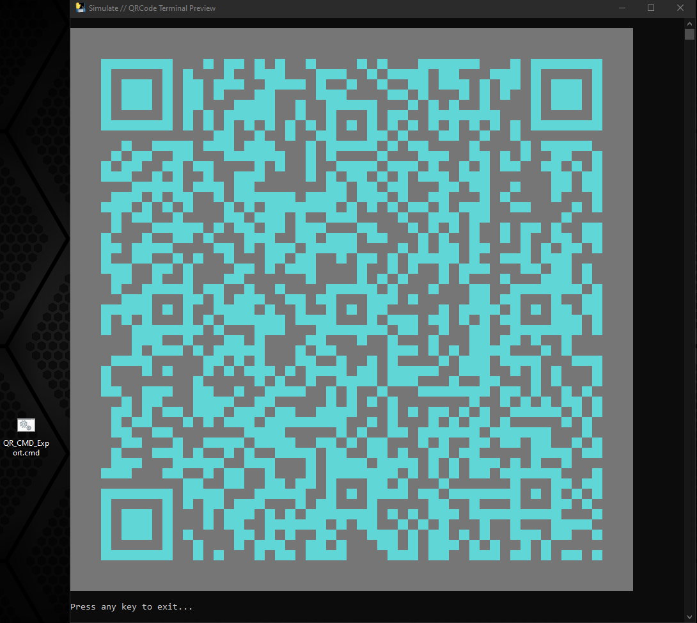

# QR Code Generator
Small wrapper of PyQRCode with small GUI example for proof of the concept.

I worked on this small project on an old laptop and tkinter is what I can get to work on it for the GUI.
Believe me... intel Pentium Dual Core and HD Graphics with not version number.

<!-- REQUIRE -->
### This project require python 3 and:
###### PyQRCode :arrow_right: For the qe code generator.
    pip install PyQRCode
###### PyPng :arrow_right: For exporting PNG images. (Also required by the PyQRCode)
    pip install pypng
###### Colorama :arrow_right: For terminal colors.
    pip install colorama

<!-- PREVIEW -->
## Preview

<!-- Max Popup content -->
> ### :window: Max Popup content
> 

> <!-- TerminalSimulator opened -->
> ### :desktop_computer: TerminalSimulator opened
> 

> <!-- TerminalSimulator rendering QR as ANSI -->
> ### :tv: TerminalSimulator rendering QR as ANSI
> 

